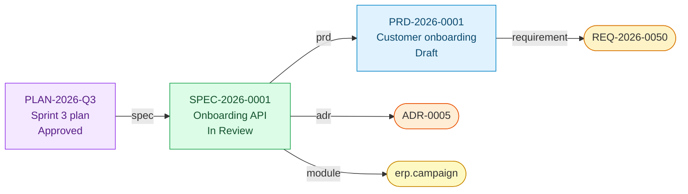

# Traceability

Every tracked document carries a YAML front-matter block describing what it is and what it depends on. The script walks those blocks to produce a dependency graph, a validation report, and a backlink index. No fuzzy text search, no "ctrl-F the PRD for related tickets" — the links are structured data.

## The schema

```yaml
---
doc_id: PRD-YYYY-NNNN
title: Short human title
owner: "@github-handle"
status: Draft          # Draft | In Review | Approved | Deprecated
date: YYYY-MM-DD
related:
  requirement: []      # REQ-YYYY-NNNN identifiers
  prd: []              # upstream PRDs
  spec: []             # SPEC-YYYY-NNNN
  plan: []             # path or plan id
  architecture: []     # architecture chapter paths
  adr: []              # ADR-NNNN identifiers
  module: []           # domain module id, e.g. billing.invoice
  confluence_page_id: null   # auto-written by the publish skill
---
```

### Doc types and their required fields

| Prefix | Type | Required `related.*` |
|---|---|---|
| `PRD-` | Product requirement | `requirement` |
| `SPEC-` | Technical spec | `prd` |
| `PLAN-` | Implementation plan | _(none beyond base)_ |
| `REQ-` | Requirement card | _(none beyond base)_ |
| `HANDOFF-` | Handoff note | _advisory only, not validated_ |

Base required (all types): `doc_id`, `title`, `owner`, `status`, `date`.

Extend types yourself by editing `REQUIRED_FIELDS` in `scripts/traceability.js`.

## What the graph looks like



Rectangular nodes are **primary** (have `doc_id` front-matter). Rounded nodes are **virtual** — referenced by at least one primary doc but not themselves tracked (typical for ADRs, modules, architecture paths).

## Why this particular schema

### Why `doc_id` instead of filename

Filenames change as titles evolve. `PRD-2026-0001` is stable across rename / relocation. Moreover, multiple files can carry the same `doc_id` during a split-brain migration period; the script will flag them.

### Why `related` is nested, not flat

Flat `adr: [...]` at the top level mixes content metadata with cross-references. A nested `related` block keeps the intent of each field visible: "these are my upstream citations" vs "these are my authors".

### Why no `children` / `blocks` keys

Child / blocked-by relationships invert automatically from parent backlinks. Expressing the edge in both directions means two places to forget to update. Pick one (forward references) and let the script compute the inverse.

## Validation rules

The `traceability:check` script enforces:

1. **Front-matter is valid YAML** — fails on unquoted `@` or tab indentation.
2. **Required fields per doc type are present** — missing `owner` blocks merge.
3. **`related.*` targets are strings or string arrays** — typos still slip through, but structural errors don't.

Nested empty arrays (`related.prd: []`) are **allowed** — the field exists, there are no references yet. That's the PRD for a greenfield feature, not a broken doc.

## What's not validated (on purpose)

- **Reference targets existing.** `related.prd: [PRD-2099-9999]` doesn't fail the check. That's deliberate — you often write forward-reference placeholders. The graph marks them as virtual nodes with no path, and the orphan section calls out dangling refs. Fail-closed on this and first-draft PRDs become impossible to save.
- **Uniqueness of doc_id.** Duplicates are flagged in the matrix's summary but don't block CI. Enforcement is on the roadmap for v0.2.

## Integrating with your workflow

- **Pre-commit**: add `npm run traceability:check -- path/to/changed/file.md` to a husky hook for the fastest feedback loop.
- **CI**: the included `.github/workflows/traceability-check.yml` runs on every PR, validates changed files, regenerates the matrix, and fails if the committed copy is stale.
- **Confluence**: see [Confluence Sync](../guides/confluence-sync.md) for the reverse loop — wiki comments + approval labels flow back into the same front-matter.

## Related

- [Concepts: DoR / DoD](./definitions-of-ready-done.md)
- [Concepts: ADR Patterns](./adr-patterns.md)
- [Guide: Traceability Matrix](../guides/traceability-matrix.md)
