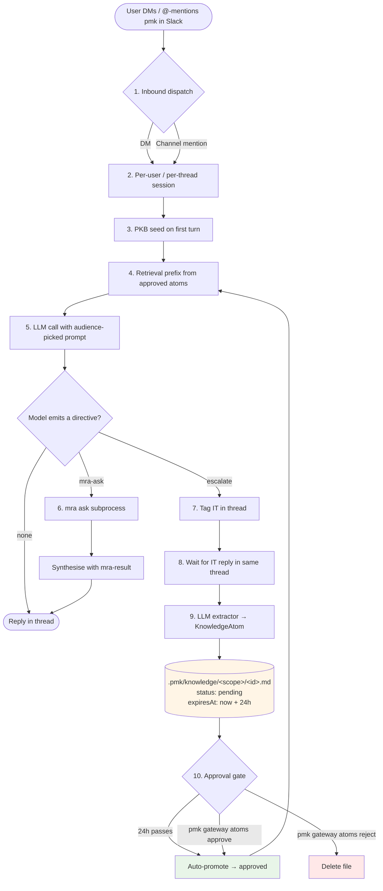

# Gateway lifecycle

How a single Slack DM walks through `pmk gateway` end-to-end. This page is the integrated story; the design rationale lives in [ADR-0006](../adr/0006-pmk-gateway-slack.md) and the v0.7.0 surface contract in [PRD-2026-0005](../prds/2026-04-27-pmk-gateway-prd.md). Each numbered phase in the diagram below is described in the section of the same name.

## The flow



## 1. Inbound dispatch

`SlackAdapter` subscribes to two Slack Socket Mode events:

- **`message`** — fires for every DM (`im.history` scope). The handler ignores messages from the bot itself and from anyone on `cfg.blocklist`.
- **`app_mention`** — fires when `@pmk` appears in a channel (`app_mentions:read` scope). Channel mentions without an active case fall through to the same free-chat path as DMs.

Both handlers ack the envelope **before** the LLM round-trip starts (Slack retries unacked events within ~3s, faster than any LLM reply). Envelope IDs are deduplicated via a bounded LRU so retries can never trigger the same turn twice.

## 2. Per-user / per-thread session isolation

Sessions are persisted on the host machine:

```
~/.pmk/gateway/slack/users/<userId>/session.json                    # main DM
~/.pmk/gateway/slack/users/<userId>/threads/<threadTs>/session.json # in-thread reply
~/.pmk/gateway/slack/channels/<channelId>/main.chat-session.json    # channel main
~/.pmk/gateway/slack/channels/<channelId>/threads/<ts>/...          # channel thread
```

A reply that lives in a Slack thread gets its own session file — context from thread A never bleeds into thread B. Top-level DMs share one "main" session per user (back-compat with v0.7.0 layout).

**Auto-pruning (v0.8.1)**: when a session's `approxTokens` crosses `MAX_SESSION_TOKENS` (default `60_000`, override via `PMK_MAX_SESSION_TOKENS` env), the oldest non-seed turns are dropped before persisting:

- The PKB seed pair (Phase 3) is always preserved
- The most recent `KEEP_RECENT_TURNS` (default 10) `(user, assistant)` pairs are always preserved
- Everything in between is replaced by a synthetic `(此處省略 N 輪較舊的對話以節省 context)` marker so the model knows there was earlier history
- Idempotent — if no new turns push back over cap, subsequent calls are no-ops

The host log line `pruned session: dropped N turn-pair(s); now <tokens> approx tokens` confirms when it fires.

## 3. PKB seed on first turn

The very first turn of any session, if `cfg.defaultIngest` is set (typically `mra:--all`), the gateway packages the four base PKB docs of every repo with a PKB directory and prepends them as a synthetic `(user → assistant)` turn pair:

```
[user]      "我先把 workspace 的 PKB context 給你 (請當作 ground truth ...) ..."
[assistant] "了解，已載入 workspace PKB context。請繼續。"
```

This is what lets the model say *"app/services/sales_budget_performance/ exists; the budget worker chains call this path"* on turn one without any retrieval round-trip.

## 4. Retrieval prefix from approved atoms

On every turn (not just the first), `searchAtoms(userText, { limit: 3 })` looks up the approved knowledge atoms most relevant to what the user just typed. If any match, they're prepended to the LLM call as **ephemeral** messages — they don't get persisted to `session.messages`, so old retrieved answers don't keep stacking up turn after turn.

Pending atoms are deliberately invisible here. See [Phase 10](#10-approval-gate).

## 5. Audience-picked prompt

The system prompt for the LLM call comes from `pickGatewayPrompt(audience)` where `audience = pickAudience(cfg, userId)`. Three flavours, all sharing a `GATEWAY_TOOLBOX` suffix that defines the `mra-ask` and `escalate` directives:

| Audience | Tone |
|---|---|
| `tech` | Cites `app/models/x.rb`, API endpoints, scope names directly |
| `pm` | (v0.8) Structural findings + file/model citations OK, but questions back to the user are translated into PM vocabulary — no formulas, no bare schema names |
| `biz` | Leads with business meaning, translates jargon, defers code questions to IT |
| `exec` | Strict 結論 / 影響(含風險) / 建議行動 — no code, no API, no file paths |

Configured per user via `pmk gateway audience set <userId> <key>`; default via `pmk gateway audience default <key>`.

## 6. mra-ask round (optional)

When PKB summaries don't cover the question (specific implementation, scope blocks, ability rules, exact column lists), the model emits a fenced directive:

````markdown
```mra-ask
repo: erp
question: where is the sales_performances scope defined?
```
````

The gateway parses this, runs `mra ask <repo> <question>` as a subprocess (120s timeout, retry-once on transient empty-stderr failures since v0.7.3), wraps the stdout in a `mra-result` user message, and re-calls the LLM for synthesis. Failures are surfaced verbatim — stderr appears in the host log AND in the LLM's apology context (since v0.7.2), so the user never sees a mysterious "unknown" error.

## 7. Escalate directive (optional, falls back from mra-ask)

When neither PKB nor mra-ask suffices (live ops state, business decisions, undocumented rules), the model emits:

````markdown
```escalate
repo: erp
question: <restated cleanly>
reason: <why neither PKB nor mra-ask works>
```
````

The gateway picks an IT contact pool via `pickEscalationPool(cfg, repo)` (repo-specific takes priority over default), `@`-mentions them in the same Slack thread, and saves a `ThreadEscalation` marker:

```
~/.pmk/gateway/slack/escalations/<channelId>__<threadTs>.json
```

The asker's `userId` is stored too so the post-absorb synthesised reply can tag them when the answer lands.

## 8. Wait for IT reply

The thread is now "pending escalation". When any subsequent message arrives in that channel-thread, the absorb-first hook in `handleMessage` / `handleAppMention` checks:

1. Does this `(channelId, threadTs)` have a pending marker?
2. Is the message's sender in `marker.mentionedUserIds`?

If both true → it's an IT contact's reply → run the absorb path. If sender isn't on the list, the marker stays pending. (For channel context the IT contact must `@pmk` their reply because we don't hold `channels:history` scope — DMs don't need this since `im:history` already gives us message visibility.)

## 9. LLM extractor → KnowledgeAtom

`extractKnowledgeAtom` runs a focused LLM call (120s timeout) with a curator-style system prompt. Input: original question + escalation reason + IT's verbatim reply. Output: bare JSON with `{ question, summary, tags }` — three keys, validated, sliced to ≤8 tags.

The result is wrapped in a `KnowledgeAtom`:

```yaml
---
id: 2026-04-28T0213-5388-如何查詢本月各部門廣告預算分配比例
createdAt: 1777342416133
scope: erp
question: 如何查詢本月各部門廣告預算分配比例？
tags: [廣告預算, 部門分配, sales_performances, budget_allocation, erp, 財務報表]
source:
  threadKey: 'D0B0E9UV52M:1777342320.134509'
  contributorUserId: U0AVBM41F6Z
status: pending
expiresAt: 1777428816133
summary: '截至 2026-04-28，本月各部門廣告預算分配比例為...'
---

# 如何查詢本月各部門廣告預算分配比例？

## Answer
<verbatim IT reply>

## Summary
<summary, also in front-matter>
```

Saved via `saveAtom()` to `~/.pmk/knowledge/<scope>/<slug>.md`, with the scope name **strictly sanitised** to `[a-zA-Z0-9_-]` characters (path traversal closed in v0.7.0).

The pending marker is cleared eagerly **before** extraction starts so two fast IT replies can't both produce duplicates (race fix landed in v0.7.0).

## 10. Approval gate

This is the v0.7.4 TTL hybrid. Atoms enter as `status: "pending"` with `expiresAt = now + 24h`. While pending:

- **Invisible to retrieval** (`searchAtoms` filters them out) — Phase 4 above won't find them.
- **Visible in CLI listings** — `pmk gateway atoms list --pending`.

Three exits:

| Trigger | Effect |
|---|---|
| 24h passes; next `loadAtoms()` call | Auto-promote: rewrite file with `status: approved`, drop `expiresAt`. Idempotent on subsequent loads. |
| `pmk gateway atoms approve <id-prefix>` | Same as above, but immediately. ID prefix matching: any unique prefix resolves. |
| `pmk gateway atoms reject <id-prefix>` | Delete the `.md` file. |

After promotion, the atom is now retrieval-visible. The next person who asks a similar question gets it prepended in Phase 4 — the loop closes.

The post-absorb synthesised reply (sent to the original asker after Phase 9 completes) bypasses the approval gate by design — the human asked a question, an authorised IT contact answered it, the answer should reach them now even if the atom is still pending for *future* queries. Only the persistent retrieval store is gated.

## Honest offline UX

Orthogonal to the directive flow but part of the gateway lifecycle:

- A heartbeat file ticks every 30s. If it's stale (> 60s) on next start, the host was offline.
- On graceful `SIGINT/SIGTERM`, the bot broadcasts `:zzz: pmk gateway 暫離` to every DM that interacted in the last 24h plus every channel with active cases.
- On startup after stale heartbeat, broadcasts `:wave: pmk gateway 重新上線（離線約 N 分鐘）`.

No `caffeinate` / launchd hacks ship by default — accepting bounded availability for honest transparency.

## See also

- [ADR-0006: pmk gateway — Slack/LINE bot, not SaaS](../adr/0006-pmk-gateway-slack.md)
- [PRD-2026-0005: pmk gateway v0.7.0 surface](../prds/2026-04-27-pmk-gateway-prd.md)
- [v0.7.0–v0.7.4 release notes on GitHub](https://github.com/hanfour/pm-workspace-kit/releases)
- [Changelog](../changelog.md) — release-by-release summary
