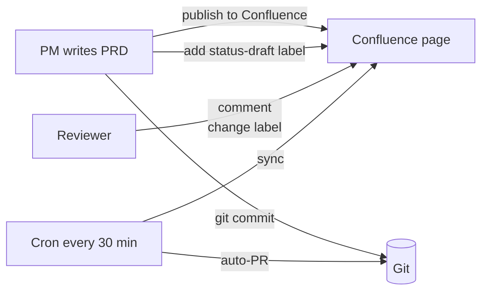

# Confluence Sync — Usage Guide

The kit treats Git as the single source of truth for content, and Confluence as the publishing + review mirror. `confluence-sync.js` closes the loop by pulling reviewer activity (comments, status labels) back into your markdown.

## What syncs

### Into your Git docs

1. **Inline + footer comments** — new ones appended to the file's `## Confluence 意見彙總` / `## Confluence Comments` section (configurable).
2. **Status labels** — mapped into the front-matter `status` field:

   | Confluence label | Front-matter `status` |
   |---|---|
   | `status-approved` | `Approved` |
   | `status-in-review` | `In Review` |
   | `status-deprecated` | `Deprecated` |
   | `status-draft` | `Draft` |

   Multiple labels? First match in the above priority order wins.

### What does _not_ sync (by design)

- **Page body edits made in Confluence** — Git stays authoritative for content. Stakeholders who need to change content still go through a PR.
- **Merge conflicts** — doesn't apply; one direction only, from Confluence metadata into Git.

## Environment variables

```bash
CONFLUENCE_BASE_URL   # e.g. https://your-org.atlassian.net/wiki
CONFLUENCE_EMAIL      # account with read + label permissions
CONFLUENCE_API_TOKEN  # from id.atlassian.com/manage-profile/security/api-tokens
```

Use a dedicated service account, not a personal one. Minimum permissions: read page content, read labels, read comments. No write scope required.

## Local usage

```bash
# List tracked pages (those with confluence_page_id in front-matter)
npm run confluence:list

# Dry-run — show what would change
npm run confluence:sync:dry

# Real sync — writes files, updates .confluence-sync-state.json
npm run confluence:sync
```

The state file `.confluence-sync-state.json` tracks last-seen comment IDs per page so reruns don't duplicate. It's gitignored by default.

## GitHub Actions setup

The kit ships `.github/workflows/confluence-sync.yml`:

```yaml
on:
  schedule:
    - cron: '*/30 * * * *'
  workflow_dispatch:
```

Runs every 30 minutes. If there are changes, it opens a PR on `auto/confluence-sync`.

### Required repo secrets

1. Settings → Secrets → Actions
2. Add:
   - `CONFLUENCE_BASE_URL`
   - `CONFLUENCE_EMAIL`
   - `CONFLUENCE_API_TOKEN`

### State persistence

The workflow uses `actions/cache` to persist `.confluence-sync-state.json` between runs. Without the cache, reruns would re-append every comment as "new".

## Publish → Sync flow end-to-end



The kit's **publish-to-confluence** skill (optional, requires Claude Code) handles:

- Building Confluence storage-format HTML from the markdown
- Creating the page
- Writing `related.confluence_page_id` back to the source front-matter
- Adding the initial `status-draft` label

Without the skill, you publish via the Confluence UI or curl and manually fill `confluence_page_id`. The sync job works either way.

## Troubleshooting

| Symptom | Likely cause |
|---|---|
| `Missing CONFLUENCE_BASE_URL env var` | Secret not set, or name mismatch |
| API returns 401 | Token expired or account disabled |
| API returns 404 on `/api/v2/pages/{id}/labels` | Wrong page id in front-matter; check `confluence_page_id` |
| Comments show up twice | `.confluence-sync-state.json` was deleted or cache didn't restore. Next run re-anchors. |
| Status not updating | Label spelling — must exact-match `status-draft` / `status-in-review` / `status-approved` / `status-deprecated` |
| Auto-PR never opens | No changes in tracked pages since last run (expected) |

## Future extensions

- **Content diff → auto-PR**: detect Confluence body drift and open a PR pulling it back. Currently out of scope.
- **@mention passthrough**: turn `@user` in a Confluence comment into a Slack tag. Simple plugin; not shipped.
- **Banner inject**: on publish, stamp "This page is auto-generated; edit source on Git" as a Confluence banner macro.

Open an issue if you want any of these — they're plugins that wouldn't change the core flow.

## Related

- [Guide: Traceability Matrix](./traceability-matrix)
- [Handoff: PR template](../handoff/pr-template)
