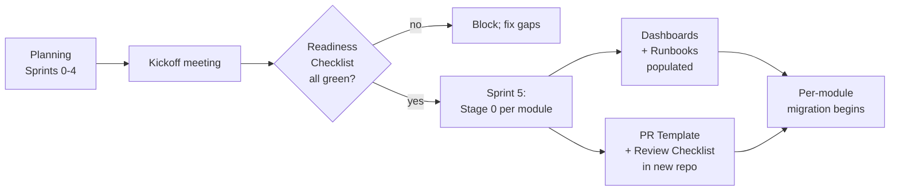

# Handoff to Implementation

All the planning in the world is wasted if the engineering team opens the repo on day one and can't tell where to start. The kit's handoff section is the set of artifacts that makes the transition from "we have a plan" to "we are executing" frictionless.

## Five artifacts, non-negotiable

1. **[Readiness Checklist](../handoff/readiness-checklist.md)** — a pre-flight list covering organization, docs, infrastructure, platform capability, migration tooling, security. Architect + PM sign off before Sprint 5 begins.
2. **[PR Template](../handoff/pr-template.md)** — carries traceability fields, migration stage, risk tier. Drop into `.github/pull_request_template.md` of the implementation repo.
3. **[Code Review Checklist](../handoff/code-review-checklist.md)** — 10 review dimensions with explicit hard-blockers (bypassing Ontology codegen, removing HITL on financial writes, regression in coverage). Used by reviewers as a ruler.
4. **[Module Runbook Template](../handoff/module-runbook-template.md)** — on-call playbook skeleton. One filled-in runbook per module before Stage 0 kicks off for that module.
5. **[Monitoring Dashboard Spec](../handoff/monitoring-dashboard-spec.md)** — six standard panels (Health, Biz KPIs, Migration, AI, Dependencies, Data Quality). Makes per-module dashboards comparable.

## Handoff sequence

## Who owns each artifact

| Artifact | Owner at handoff time |
|---|---|
| Readiness Checklist | Architect + PM Lead (joint sign-off) |
| PR Template | DevOps / platform lead drops into new repo |
| Code Review Checklist | Engineering lead distributes to all reviewers |
| Module Runbook | Per-module engineering owner |
| Monitoring Dashboard | SRE / platform lead, one per module |

## Common handoff failure modes

### "We'll fix it in Sprint 6"

A Readiness item being unchecked _should_ block the handoff. Teams tempted to defer items end up discovering them as production incidents. Don't. If SSO isn't working in staging, that's a Sprint 5 kickoff blocker, not a later sprint's item.

### "The runbook is the architect's job"

No. The engineer who'll be on-call fills the runbook. The architect reviews it. If the engineer can't fill it, they don't know the module well enough to own it yet — that's the signal, not a paperwork delay.

### "We'll build the dashboard after launch"

The dashboard exists _before_ Stage 1 of any module. Panels on Block A (Health) and Block C (Migration) should show `no data yet` rather than panels being absent. You can't debug what you can't see.

### "PR template is just a form; reviewers skip it"

Ensure at least the traceability fields are mandatory (CI check enforces format). If the PR body is empty, the PR doesn't merge. Reviewers don't have to _read_ the checklist, but contributors have to _fill it out_.

## What happens after handoff

The planning workspace (this kit or your domain-specific extension) becomes **read-only reference**. Day-to-day work moves to the implementation repo. The planning repo is consulted for:

- Looking up ADR rationale
- Re-reading the Strangler Fig protocol
- Reviewing the north star during quarterly planning
- Onboarding new team members

If the planning docs start drifting from reality, that's a signal to schedule a mini-Sprint to reconcile — not to abandon the docs. Plans go stale fast (see the kit's retrospective template for the typical decay curve).

## Related

- [Handoff Overview](../handoff/overview.md)
- [Concepts: Strangler Fig](../concepts/strangler-fig.md)
- [Guide: Authoring North Star](./authoring-north-star.md)
