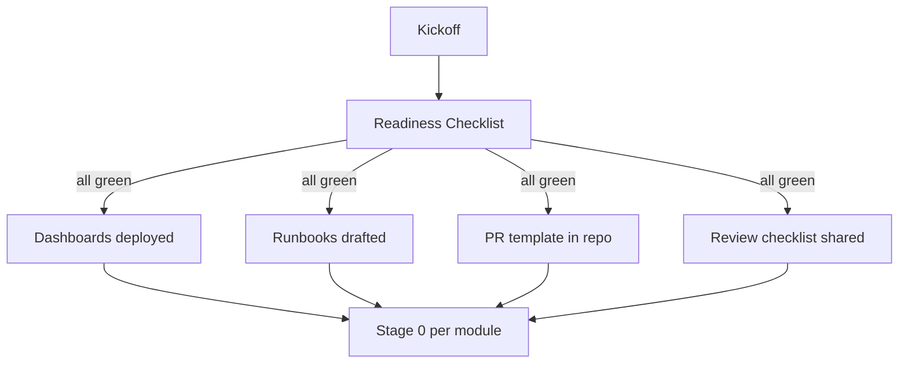

# Handoff Kit Overview

Five artifacts an engineering team inherits when planning ends and implementation begins. Copy the five files into the implementation repo's `.github/`, `docs/`, or team wiki. They're written to drop in without edits.

| File | Goes into | Purpose |
|---|---|---|
| [`pr-template.md`](./pr-template.md) | `.github/pull_request_template.md` | Mandatory traceability, migration-stage, risk tier fields |
| [`code-review-checklist.md`](./code-review-checklist.md) | `docs/CODE_REVIEW.md` or wiki | 10 review dimensions with explicit hard-blockers |
| [`module-runbook-template.md`](./module-runbook-template.md) | `apps/<service>/<module>/RUNBOOK.md` | Per-module on-call playbook skeleton |
| [`monitoring-dashboard-spec.md`](./monitoring-dashboard-spec.md) | Datadog / Grafana / Vercel Analytics | 6-panel standard layout |
| [`readiness-checklist.md`](./readiness-checklist.md) | Sprint 5 kickoff gate | Architect + PM joint sign-off |

## Principles

### Copy, don't customize

If your team starts bikeshedding the template before using it, you've lost. Copy the template as-is. Customize after 2–3 sprints of real use.

### Traceability is not optional

Every artifact above ties back to `doc_id` or migration stage. Removing those fields defeats the reason the kit exists.

### HITL doesn't get downgraded

The code-review checklist has hard-blockers for removing Human-in-the-Loop gates on financial / irreversible writes. This is non-negotiable regardless of deadline pressure.

## How they fit together

## Related

- [Guide: Handoff to Implementation](../guides/handoff-to-implementation.md) — the overall sequence and failure modes
