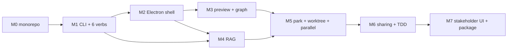

# pmk Desktop App — Sprint Plan

3–4 month part-time build, organized into 8 milestones. Each milestone ends with a demoable deliverable and a go/no-go gate.

## M0 — Monorepo refactor ✅ (2026-04-24, done)

- [x] Restructure repo into `apps/*` + `packages/*` workspaces
- [x] Move Docusaurus to `apps/docs/`
- [x] Move scripts to `packages/core/src/`
- [x] Create stubs for `apps/desktop/`, `packages/cli/`, `packages/rag/`, `packages/shared/`
- [x] Update `.github/workflows/` paths
- [x] Verify `npm run build` still green
- [x] Commit on `feat/desktop-app` branch

**Gate**: Docusaurus site still deploys; `npm run traceability:check` green.

---

## M1 — CLI scaffold + core 6 verbs (2 weeks)

**Goal**: `pmk --help` works; all six verbs produce something useful, even if primitive.

- [ ] `packages/cli/src/index.ts` — Commander wiring
- [ ] `packages/shared/src/prompts.ts` — externalize prompt templates from Claude Code skills (port the 14 skill bodies into reusable string templates)
- [ ] `packages/cli/src/commands/propose.ts` — interactive prompt → write to `docs/prds/<id>.md`
- [ ] `packages/cli/src/commands/ingest.ts` — read existing doc, store in session context
- [ ] `packages/cli/src/commands/apply.ts` — execute decomposed plan
- [ ] `packages/cli/src/commands/discuss.ts` — structured brainstorm
- [ ] `packages/cli/src/commands/ask.ts` — stub (returns "index missing, run pmk index")
- [ ] `packages/cli/src/commands/debug.ts` — stub
- [ ] Wire `@anthropic-ai/sdk` with streaming
- [ ] API key reads from `$ANTHROPIC_API_KEY` or config file; will integrate with keychain in M2
- [ ] Unit tests for command parsing
- [ ] `npm run pmk -- propose` works end-to-end on a real API key

**Gate**: Can run `pmk propose "Customer onboarding"`, have a conversation, and produce a valid front-matter PRD at `apps/docs/docs/prds/*`.

---

## M2 — Electron shell + Monaco editor (2 weeks)

**Goal**: Desktop app opens, shows a file tree, editor, and preview pane.

- [ ] `apps/desktop/package.json` — Electron 33, Vite, React, Tailwind
- [ ] Main process: window creation, menu, IPC registration
- [ ] Preload script: exposed API surface (`fs`, `git`, `llm`)
- [ ] Renderer: 3-pane layout (tree / editor / preview)
- [ ] Monaco editor with Markdown + YAML syntax, front-matter linting
- [ ] File tree bound to repo workspace (uses `simple-git` to distinguish tracked files)
- [ ] Keychain integration for API key (via `keytar`)
- [ ] `npm run desktop:dev` launches the app in dev mode with HMR
- [ ] First-run dialog: ask for API key, store in keychain

**Gate**: Open app, type in editor, save file, see it appear in file tree.

---

## M3 — Preview + traceability graph (2 weeks)

**Goal**: Live Markdown + Mermaid preview; visual dependency graph of tracked docs.

- [ ] Right pane: `unified` + `remark-gfm` + `remark-mermaid` + `rehype-highlight`
- [ ] Scroll sync between editor and preview
- [ ] Traceability graph: use `@pmk/core` to build node/edge model, render via `reactflow` or `cytoscape`
- [ ] Click node → opens corresponding file in editor
- [ ] Graph auto-refreshes on file save
- [ ] "Stale matrix" indicator in status bar

**Gate**: Edit a PRD's `related.adr`, save, see the graph update with a new edge.

---

## M4 — RAG over corpus (2 weeks)

**Goal**: `pmk ask "when did we decide to use NestJS?"` returns the relevant ADR with citation.

- [ ] `packages/rag/src/index.ts` — embedding + HNSW index
- [ ] Indexer: walk `apps/docs/docs/**/*.md`, chunk at heading boundaries, embed via Anthropic or Voyage
- [ ] Persist index to SQLite + hnswlib binary
- [ ] `pmk index` rebuilds; `pmk ask "..."` queries top-5, stuffs into context, streams answer
- [ ] Cite sources back as `[file:line]`
- [ ] Desktop integration: "Ask" panel in UI, result shows links to source files
- [ ] Incremental reindex on file save (debounced)

**Gate**: 100-doc corpus indexed < 30s; query latency < 500ms; human-judged relevance on 10 sample queries ≥ 8/10.

---

## M5 — Park + Git worktree + Parallel (3 weeks)

**Goal**: WIP management and parallel execution — Spectra's core differentiator.

### Park
- [ ] `.pmk/park/<name>/` directory schema (gitignored)
- [ ] `pmk park <slug>` — stash current WIP state
- [ ] `pmk unpark <slug>` — restore, optionally into new worktree
- [ ] Desktop: "Park drawer" sidebar; drag-and-drop
- [ ] Metadata: creation time, last touched, associated doc_ids

### Git worktree
- [ ] `pmk worktree add/list/remove` wrapping `git worktree`
- [ ] Desktop: "New parallel workspace" action → creates worktree at `../worktree-<branch>/`, opens new window
- [ ] Switch active workspace from UI

### Parallel execution
- [ ] `pmk apply --parallel <plan-file>` — run decomposed tasks via `Promise.all`
- [ ] Per-task progress + token + cost display
- [ ] Max concurrency from settings (default 3)
- [ ] Graceful abort on first error (configurable)

**Gate**: Park 3 WIPs, unpark into worktrees, run parallel apply across all — no Git state corruption.

---

## M6 — File sharing + TDD flow (2 weeks)

### File sharing
- [ ] Integrate with Vercel Blob (or CF R2) — user configures once
- [ ] Render target doc to static HTML + assets
- [ ] Upload with 24h TTL signed URL
- [ ] Return URL; optionally copy to clipboard
- [ ] Privacy: never upload content outside selected file + its direct refs

### TDD flow
- [ ] `pmk tdd <feature>` — walks RED → GREEN → REFACTOR
- [ ] Stage 1: write failing test (model generates); user approves
- [ ] Stage 2: write minimal implementation; run tests; iterate until green
- [ ] Stage 3: refactor suggestions
- [ ] Desktop UI: 3-step wizard with stage indicator

**Gate**: Share a PRD, get URL that renders correctly on external browser; complete a TDD cycle end-to-end on a trivial function.

---

## M7 — Stakeholder UI + polish + package (2 weeks)

**Goal**: v1.0 release-ready.

- [ ] "Simplified mode" — hide editor, show spec browser + status + approve button only
- [ ] Settings panel: API key, budget cap, UI mode, language
- [ ] Token usage dashboard (session + cumulative month)
- [ ] i18n: zh-TW translation parity with EN
- [ ] Keyboard shortcuts catalog + cheat sheet modal
- [ ] `electron-builder` config for 3 platforms
- [ ] Code signing: macOS (Apple Developer ID), Windows (cert TBD; may ship unsigned for v1.0)
- [ ] Auto-update via GitHub Releases + `electron-updater`
- [ ] In-app "What's new" dialog on first launch after update
- [ ] Installer icons + branding
- [ ] Release v1.0.0 on GitHub

**Gate**: Download on clean macOS / Windows / Linux machine → first command works in ≤ 3 min.

---

## Milestone dependency graph

M4 can overlap with M3 (different packages). Everything else is serial because each builds on the previous shell / editor surface.

## Kill-switch criteria

Cancel or descope if any of these trigger:

- **Week 6**: M1+M2 incomplete → descope RAG (M4) to v1.1, ship cut-down v0.5 with just CLI + editor
- **Week 10**: Bundle size > 200 MB or startup > 5s → re-evaluate Electron (consider Tauri spike)
- **Week 12**: User testing shows no demand for Park/worktree → defer M5 to v1.1
- **Week 14**: File sharing provider not chosen → drop F12 from v1.0

## Team / capacity

Single contributor (@hanfour) part-time. ~10–15 h/week realistic. 15-week plan assumes ~12 h/week average.

## Review cadence

- End of each milestone: self-review against PRD's Success Metrics column
- Every 4 weeks: recalibrate remaining timeline, update kill-switch status
- v1.0 release: full retrospective, publish lessons for next version

## Related

- [PRD-2026-0002](../prds/2026-04-24-desktop-app-prd.md)
- [ADR-0004: Electron choice](../adr/0004-desktop-framework.md)
