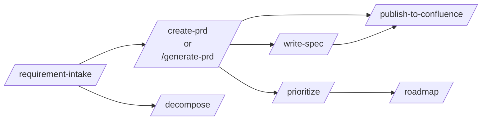

# Skills Catalog

The kit ships 14 Claude Code skills that map onto the PM workflow. Each skill is a self-contained prompt + instructions file you drop into `.claude/skills/` in your project. Claude Code invokes the skill automatically when its description matches the user's intent, or explicitly via `/<skill-name>`.

## Pipeline view



## The 14 skills

### Core pipeline (5)

| Skill | What it does | When |
|---|---|---|
| [requirement-intake](./requirement-intake) | AI-guided requirement elicitation | Stakeholder brings a fuzzy idea |
| [generate-prd](./generate-prd) | Auto-generate PRD from a requirement card | Requirement is clear, small/medium scope |
| [create-prd](./create-prd) | Interactive PRD authoring | Large-scope or greenfield feature |
| [write-spec](./write-spec) | Translate approved PRD into technical spec | PRD approved, engineering needs detail |
| [publish-to-confluence](./publish-to-confluence) | Push doc to Confluence + sync back | PRD / spec in `Approved` status |

### Discovery & planning (4)

| Skill | What it does | When |
|---|---|---|
| [brainstorm-new](./brainstorm-new) | Multi-angle ideation for new products | Zero-to-one product discovery |
| [brainstorm-existing](./brainstorm-existing) | Extension ideas for existing products | Quarterly planning |
| [research](./research) | Structured competitive / market research | PRD needs market context |
| [gather-requirements](./gather-requirements) | Structured stakeholder interview | Requirements not coming out in writing |

### Decomposition & prioritization (3)

| Skill | What it does | When |
|---|---|---|
| [decompose](./decompose) | Break a requirement into actionable tasks | Moving from requirement to execution |
| [prioritize](./prioritize) | Apply MoSCoW / RICE frameworks | Feature list is long, capacity is short |
| [roadmap](./roadmap) | Sequence features into a time plan | Quarterly / annual planning |

### Operational (2)

| Skill | What it does | When |
|---|---|---|
| [bug-report](./bug-report) | Guided bug intake with triage | User reports a bug informally |
| [create-pptx](./create-pptx) | Build PowerPoint from markdown | Stakeholder wants slides |

## How to install a skill

Each skill page has its body inside a code block. Copy the content into a file under `.claude/skills/` in your project:

```bash
mkdir -p .claude/skills
# Copy the content from docs site into .claude/skills/<skill-name>.md
```

Claude Code picks it up automatically. Verify with `/help` — the skill should appear in the list.

## Customizing for your workflow

The kit's skills are written for a generic B2B SaaS workflow. Expect to customize:

- Company-specific terminology (replace generic "customer" with your domain word)
- Output file paths (kit uses `docs/prds/`, `docs/specs/`, etc.)
- Publishing target (kit uses Confluence; replace with Notion / your wiki as needed)
- Language (kit skills are English; you can translate or adapt)

## Skills that require tools

Some skills invoke external APIs. Those will work only when the tool is configured:

- **publish-to-confluence** — needs browser or HTTP tool with Confluence access
- **create-pptx** — needs the [Anthropic Agent Skills API](https://docs.anthropic.com/) or equivalent PPTX generator
- **research** — works best with web-fetch capability

The skills gracefully degrade if the tool isn't available (they'll ask you to provide the info manually).

## Related

- [Concepts: DoR / DoD](../concepts/definitions-of-ready-done) — quality gates between skills
- [Guide: Handoff to Implementation](../guides/handoff-to-implementation) — what happens after PRD → Spec
