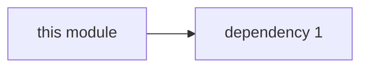
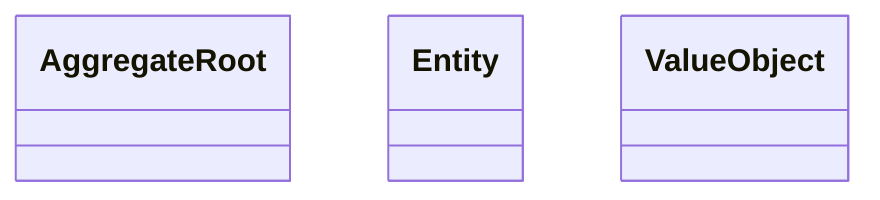
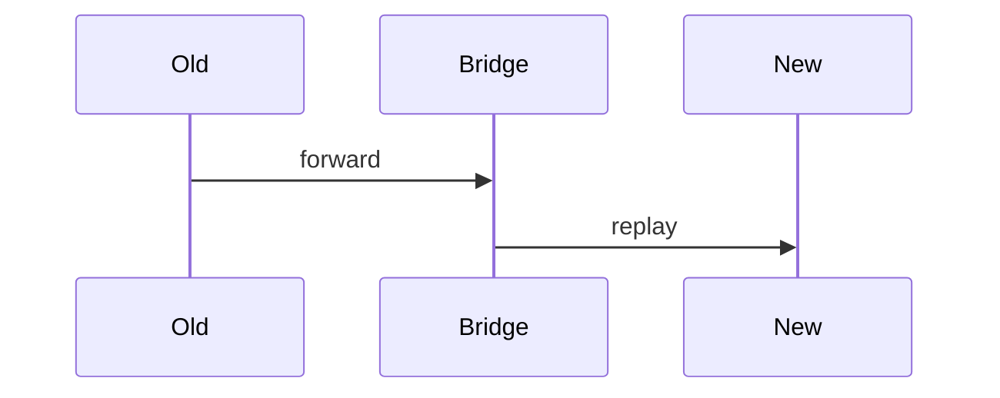

# Module Migration Playbook Template

One playbook per module being migrated via Strangler Fig. Copy to `docs/architecture/modules/<module-id>-migration.md` and fill in.

Twelve sections. Sections 1–3 are essential in Stage 0 prep. Sections 4–8 fill during Stage 0–1. Sections 9–12 mature through the migration.

---

````markdown
# <Module Name> — Migration Playbook

- **Module ID:** <domain.module_id>
- **Status:** Draft <!-- Draft | In Migration | Retired -->
- **Date:** YYYY-MM-DD
- **Owner:** @<engineering-lead>
- **Migration Priority:** Group <1|2|3|4>
- **Source Ontology:** <ontology path or N/A>

## 1. Module Overview
<Business role. Entities. Scale (daily writes, active rows). Why this module is in this migration group.>

## 2. As-Is Structure
### Models / Controllers / Services
- <List current models>
- <List current controllers>
- <List current services — note which are "fat" and need splitting>

### Dependency diagram


## 3. Target Schema / Ontology Mapping

### Coverage
| Entity | Covered in new system | Gap |
|---|---|---|
| A | ✅ | — |
| B | ⚠️ partial | missing field `foo` |

### Gaps to backfill
<Field additions, state machines, business rules that are missing>

## 4. To-Be Domain Model
### Bounded context
<What does this module own? What does it explicitly not own?>

### Aggregates / Entities / Value Objects


### Module structure
```
apps/<app>/src/<module>/
  <module>.module.ts
  services/
  domain/
    aggregates/
    value-objects/
```

## 5. To-Be Data Model
### Schema (generated / hand-written)
<Schema snippet>

### Index strategy
| Column | Index type | Reason |
|---|---|---|

### Dual-write design
<How do the old and new schemas coexist during Stages 2–3?>

## 6. API Contract
### New endpoints / RPC procedures
<tRPC / OpenAPI / RPC contract>

### Compatibility with legacy endpoints
| Legacy | New | Strategy | Sunset date |
|---|---|---|---|

## 7. Agent Tools (if exposed to AI)
| Tool name | Purpose | Auth | HITL |
|---|---|---|---|
| `<module>.list` | | role ≥ viewer | no |
| `<module>.create` | | role ≥ operator | yes if amount > X |

## 8. LLM Use Cases
Describe one use case per AI stage (Copilot / Embedded / Agentic / AI-Native) if applicable.

## 9. Migration Steps (Strangler Fig)


### Per-stage checklist
**Stage 0 (Prep)**
- [ ] Ontology / schema ready
- [ ] Reconciliation tooling runnable
- [ ] Feature flag `migration.<module>.mode` created

**Stage 1 (Shadow Read)** 
- [ ] Diff < SLO for 7 days

**Stage 2 (Double Write)**
- [ ] Diff < SLO for 14 days

**Stage 3 (Cutover)**
- [ ] KPIs steady for 14 days

**Stage 4 (Retire)**
- [ ] Observation period complete
- [ ] Old code path frozen

## 10. Risks & Rollback
| Risk | Likelihood | Impact | Mitigation | Rollback |
|---|---|---|---|---|

## 11. Success Metrics
| KPI | Baseline | Target |
|---|---|---|
| Reconciliation diff rate | — | < X% |
| p95 latency | — | ≤ baseline |
| Error rate | — | ≤ baseline |
| Migration duration | — | ≤ N weeks |

## 12. Related ADRs
- ADR-NNNN: <why this design>
- Cross-module: <related modules, contracts>
````
