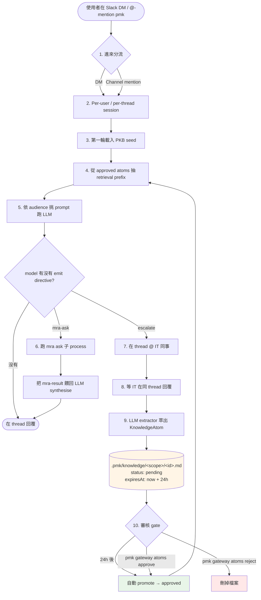

# Gateway 生命週期

一條 Slack DM 從進到 `pmk gateway` 到落地的整個流程。設計動機請看 [ADR-0006](../adr/pmk-gateway-slack)，v0.7.0 的表面合約見 [PRD-2026-0005](../prds/2026-04-27-pmk-gateway-prd)。下方流程圖中的編號對應到同名的章節。

## 流程圖



## 1. 進來分流

`SlackAdapter` 訂兩種 Slack Socket Mode 事件：

- **`message`** — 每條 DM 都觸發（需 `im.history` scope）。handler 會跳過 bot 自己發的訊息與 `cfg.blocklist` 內的人。
- **`app_mention`** — channel 裡 `@pmk` 才觸發（需 `app_mentions:read` scope）。沒 active case 的 channel mention 會掉到跟 DM 同一條 free-chat 路徑。

兩個 handler 都在 LLM round-trip 開始**之前**先 ack envelope（Slack 會在 ~3s 內重送沒 ack 的事件，比任何 LLM 回覆都快）。Envelope ID 用一個 bounded LRU 去重，所以重送永遠不會觸發同一輪兩次。

## 2. Per-user / per-thread session 隔離

Session 都存在 host 機器上：

```
~/.pmk/gateway/slack/users/<userId>/session.json                    # 主 DM
~/.pmk/gateway/slack/users/<userId>/threads/<threadTs>/session.json # thread 內回覆
~/.pmk/gateway/slack/channels/<channelId>/main.chat-session.json    # channel 主流
~/.pmk/gateway/slack/channels/<channelId>/threads/<ts>/...          # channel thread
```

開在 Slack thread 裡的回覆有自己的 session 檔案 — thread A 的 context 永遠不會洩漏到 thread B。Top-level DM 共用一個 "main" session（保留 v0.7.0 layout 的相容性）。

**自動修剪（v0.8.1）**：當 session 的 `approxTokens` 超過 `MAX_SESSION_TOKENS`（預設 `60_000`，可用 `PMK_MAX_SESSION_TOKENS` env 覆蓋）時，落地之前會把較舊的 turn 砍掉：

- PKB seed pair（Phase 3）一定保留
- 最近 `KEEP_RECENT_TURNS`（預設 10）對 `(user, assistant)` 一定保留
- 中間的全部換成一條 `(此處省略 N 輪較舊的對話以節省 context)` 合成 user 訊息，讓 model 知道之前還有歷史
- Idempotent — 沒有新訊息再次衝過 cap 的話，下次呼叫是 no-op

Host log 出現 `pruned session: dropped N turn-pair(s); now <tokens> approx tokens` 即代表觸發。

## 3. 第一輪 PKB seed

任何 session 的第一輪，如果 `cfg.defaultIngest` 有設（通常是 `mra:--all`），gateway 會把每個有 PKB 目錄的 repo 的四份 base 文件打包成一段假的 `(user → assistant)` 對話前綴：

```
[user]      "我先把 workspace 的 PKB context 給你（請當作 ground truth ...）..."
[assistant] "了解，已載入 workspace PKB context。請繼續。"
```

這就是為什麼 model 第一輪就能講 *"app/services/sales_budget_performance/ 存在；budget worker chain 會走這條路徑"* — 不需要先跑 retrieval。

## 4. 從 approved atoms 抽 retrieval prefix

每一輪（不只第一輪），`searchAtoms(userText, { limit: 3 })` 找出與當下使用者輸入最相關的 approved atoms。命中的 atoms 以 **ephemeral** 訊息形式 prepend 到這次 LLM call — 不會寫進 `session.messages`，所以舊的 retrieved 答案不會一輪一輪疊上去。

Pending atoms 在這裡刻意看不到。詳見 [Phase 10](#10-審核-gate)。

## 5. 依 audience 挑 prompt

LLM call 的 system prompt 由 `pickGatewayPrompt(audience)` 決定，其中 `audience = pickAudience(cfg, userId)`。三種口吻共用一段 `GATEWAY_TOOLBOX` 後綴，後綴定義 `mra-ask` 與 `escalate` 兩個 directive：

| Audience | 口吻 |
|---|---|
| `tech` | 直接引用 `app/models/x.rb`、API endpoint、scope 名稱 |
| `pm` | (v0.8) 結構發現 + 檔案/model 引用照給，但**反問使用者的問題**翻成 PM 用語 — 不出現公式、不出現 schema 欄位名 |
| `biz` | 先講業務意義、翻譯 jargon、把 code 問題推給 IT |
| `exec` | 嚴格三段式 結論 / 影響(含風險) / 建議行動 — 不出現程式碼、API、檔案路徑 |

設定方式：`pmk gateway audience set <userId> <key>` 個別覆蓋；`pmk gateway audience default <key>` 改預設。

## 6. mra-ask round（選用）

當 PKB 摘要不足以回答（具體實作、scope 區塊、ability 規則、確切欄位列表），model 會 emit fenced directive：

````markdown
```mra-ask
repo: erp
question: where is the sales_performances scope defined?
```
````

Gateway parse 出來後跑 `mra ask <repo> <question>` 子 process（120s timeout，自 v0.7.3 起對 transient 的 empty-stderr 失敗會 retry 一次），把 stdout 包進 `mra-result` user 訊息再 call 一次 LLM 做 synthesis。失敗時 stderr 會原樣 surface 到 host log 與 LLM 的 apology context（自 v0.7.2），使用者不會看到莫名其妙的 "unknown" 錯誤。

## 7. Escalate directive（選用，從 mra-ask 退一階）

當 PKB 與 mra-ask 都答不出（live ops 狀態、商業決策、未文件化的規則），model emit：

````markdown
```escalate
repo: erp
question: <重新整理過的問題>
reason: <為什麼 PKB 與 mra-ask 都不夠>
```
````

Gateway 透過 `pickEscalationPool(cfg, repo)` 挑一組 IT 聯絡人（repo 特定優先於 default），在同一條 Slack thread `@`-mention 他們，並存一個 `ThreadEscalation` marker：

```
~/.pmk/gateway/slack/escalations/<channelId>__<threadTs>.json
```

提問者的 `userId` 也存進去，這樣 absorb 完之後合成的回覆才能 tag 對人。

## 8. 等 IT 回覆

這條 thread 現在處於「pending escalation」狀態。後續任何進到這個 channel-thread 的訊息，`handleMessage` / `handleAppMention` 開頭的 absorb-first hook 會檢查：

1. 這個 `(channelId, threadTs)` 有沒有 pending marker？
2. 訊息發送者是不是 `marker.mentionedUserIds` 內的人？

兩個都 yes → 就是 IT 同事的回覆 → 走 absorb path。發送者不在名單就維持 pending。（在 channel 場景，IT 同事必須 `@pmk` 才接得到 — 因為我們沒持有 `channels:history` scope；DM 不用這層因為 `im:history` 已經給我們訊息可見性。）

## 9. LLM extractor → KnowledgeAtom

`extractKnowledgeAtom` 跑一次 focused LLM call（120s timeout），用 curator 風格的 system prompt。Input：原始問題 + escalation reason + IT 的 verbatim 回覆。Output：純 JSON `{ question, summary, tags }` — 三個 key、驗證、tags 切到 ≤ 8 個。

結果包成一個 `KnowledgeAtom`：

```yaml
---
id: 2026-04-28T0213-5388-如何查詢本月各部門廣告預算分配比例
createdAt: 1777342416133
scope: erp
question: 如何查詢本月各部門廣告預算分配比例？
tags: [廣告預算, 部門分配, sales_performances, budget_allocation, erp, 財務報表]
source:
  threadKey: 'D0B0E9UV52M:1777342320.134509'
  contributorUserId: U0AVBM41F6Z
status: pending
expiresAt: 1777428816133
summary: '截至 2026-04-28，本月各部門廣告預算分配比例為...'
---

# 如何查詢本月各部門廣告預算分配比例？

## Answer
<IT 同事的 verbatim 回覆>

## Summary
<summary，也在 front-matter>
```

透過 `saveAtom()` 落到 `~/.pmk/knowledge/<scope>/<slug>.md`，scope 名會被嚴格 sanitise 成 `[a-zA-Z0-9_-]`（v0.7.0 把 path traversal 封掉了）。

Pending marker 在 extraction **之前**就會被清掉 — 兩個 IT 同事連續快速回覆才不會兩個都觸發 extract（v0.7.0 race fix）。

## 10. 審核 gate

這是 v0.7.4 的 TTL hybrid。Atoms 進來時 `status: "pending"`、`expiresAt = now + 24h`。Pending 期間：

- **retrieval 看不到**（`searchAtoms` 過濾掉）— Phase 4 不會撈到
- **CLI 看得到** — `pmk gateway atoms list --pending`

四條離開路徑：

| 觸發 | 效果 |
|---|---|
| 24h 過了；下次 `loadAtoms()` | 自動 promote：重寫檔案 `status: approved`、清掉 `expiresAt`。後續 load 是 idempotent 的。 |
| `pmk gateway atoms approve <id-prefix>` | 同上，但立即。ID prefix matching：唯一的 prefix 就解析得出 atom。 |
| `pmk gateway atoms reject <id-prefix>` | 刪掉 `.md` 檔。 |
| **(v0.8.5)** 在 bot 的 pending 通知上 ✅ react | 同 `approve` — 但在 Slack 裡完成、不用回 host 終端。只有原 IT contributor（`atom.source.contributorUserId`）有權限；其他人 react 會被忽略。❌ react 等同 `reject`。需 Slack app 加 `reactions:read` scope。 |

Promote 完後 atom 對 retrieval 可見。下一個問類似問題的人在 Phase 4 就會被 prepend — loop 收口。

Phase 9 結束後寄給原提問者的合成回覆**不**經過 approval gate（設計如此） — 人問了問題，授權的 IT 同事答了，這個答案應該立刻送到提問者手上，即便 atom 對**未來**查詢還在 pending。只有持久化 retrieval store 才被 gate 住。

## 11. Admin 指令（v0.9.0）

`/pmk admin <subcommand>` 讓管理員直接從 Slack 內部跑 gateway-config 變更 — 跟 host CLI 同一組面向，日常運維不需要回終端機。

:::tip 兩種觸發方式（v0.9.1+）

[v0.9.1](https://github.com/hanfour/pm-workspace-kit/releases/tag/v0.9.1)（[#39](https://github.com/hanfour/pm-workspace-kit/issues/39)）開始，`/pmk` 已註冊為正式的 Slack slash-command。建議直接打 `/pmk admin help` — Slack 會自動補完，把 `slash_commands` envelope 直接送給 bot。不用加 leading space、不會被 Slackbot 提示、回應也不開 thread。

舊的 text-message 路徑（` /pmk admin help` 前面加空格）仍保留為 fallback：給已經習慣這種寫法的人用，也給未來部署到沒註冊 slash-command 的 Slack app 時備用。Gateway 端 `handleDmMessage` / `handleChannelMention` 還是會在 `text.trim()` 後比對 `text.startsWith("/pmk ")`。

涵蓋指令：`/pmk help`、`/pmk open`、`/pmk show`、`/pmk close`、`/pmk cases`、`/pmk admin`。

:::

**Bootstrap 必須走終端機。**第一個 admin 必須在 host 端用 `pmk gateway admin add <userId>` 加進去。沒有「從 Slack 把自己加成 admin」的路徑 — 設計如此，因為 workspace 裡每個人都能跑 slash command。

**只能在 DM 用。**在 channel 跑 `/pmk admin` 會回 `:no_entry_sign:`，什麼也不做。這樣可以把審計相關的 mutation 排除在 channel 的 scroll history 之外，也避免不小心外洩。

**Last-admin 保護。**移除唯一的 admin（不論用 `/pmk admin admins remove` 還是 host CLI 的 `pmk gateway admin remove`、即便對象是自己）會被拒絕。請先加一個替補。

指令列表（DM + 限 admin）：

| 指令 | 用途 |
|---|---|
| `/pmk admin status` | mra workspace、default ingest、audience default、admin 數量、escalation pool 大小 |
| `/pmk admin audience set @user <tier>` / `unset @user` / `default <tier>` / `list` | 個別使用者 audience override + 預設值。`<tier>` 為 `tech`、`pm`、`biz`、`exec` 之一。 |
| `/pmk admin escalation add <repo\|default> @user` / `remove ...` / `list` | IT / 領域聯絡人池 |
| `/pmk admin atoms list [pending\|approved\|all]` / `show <id-prefix>` / `approve ...` / `reject ...` | 跟 CLI 同樣的 atom 審核；**edit** 仍只走 CLI（避免直接從 Slack 貼入的內容 verbatim 進 retrieval） |
| `/pmk admin admins list` / `add @user` / `remove @user` | 管理 admin 列表 |
| `/pmk admin audit [N]` | 最近 N 筆 admin 動作（預設 20）— 涵蓋 Slack / CLI 兩種來源 |

**Audit log。**每筆 admin 變更（不論來自 Slack 還是 host CLI）都會在 `~/.pmk/gateway/admin.log` 加一行 JSONL：

```json
{"at":"2026-04-28T...","actor":"U0HANFOUR","origin":"slack","action":"audience.set","args":"U0XYZ pm","ok":true}
```

`origin: "slack"` 時 `actor` 是 Slack user ID；`origin: "cli"` 時則是 `cli:<unix_user>`。權限不足、驗證失敗、last-admin 保護等狀況會以 `ok: false` 記錄，並附上 `reason`。

**刻意不開放給 Slack 的範圍：**

- `init`（會把 Slack tokens 明文 echo 出來）
- Token 輪替
- `atoms edit`（貼入內容會 verbatim 進 retrieval — `$EDITOR` + 驗證的 CLI 路徑安全得多）
- Process stop / restart
- Blocklist 變更（等之後有 tier-2 admin 模型再說）

## Honest offline UX

跟 directive 流程獨立，但屬於 gateway 生命週期的一部分：

- 一份 heartbeat 檔每 30 秒打卡。下次啟動時若超過 60 秒沒打 → host 之前離線過。
- 收到 `SIGINT/SIGTERM` 優雅關閉時：bot 會對最近 24h 互動過的 DM 與所有有 active case 的 channel 廣播 `:zzz: pmk gateway 暫離`。
- 啟動後若偵測到 stale heartbeat：廣播 `:wave: pmk gateway 重新上線（離線約 N 分鐘）`。

預設不附 `caffeinate` / launchd 之類 hack — 接受有界的可用性，換取誠實的透明度。

## 延伸閱讀

- [ADR-0006: pmk gateway — Slack/LINE bot, not SaaS](../adr/pmk-gateway-slack)
- [PRD-2026-0005: pmk gateway v0.7.0 surface](../prds/2026-04-27-pmk-gateway-prd)
- [v0.7.0–v0.9.0 release notes on GitHub](https://github.com/hanfour/pm-workspace-kit/releases)
- [Changelog](../changelog) — release-by-release 摘要
