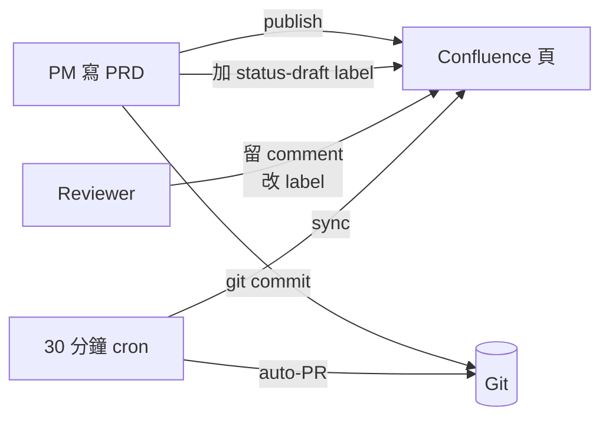

# Confluence Sync（使用指南）

kit 以 Git 為內容 source of truth、Confluence 為發佈 + review 鏡像。`confluence-sync.js` 把 reviewer 活動（評論、狀態 label）拉回 markdown 閉環。

## 同步什麼

### 進 Git 的內容

1. **Inline + footer comments** — 新的追加到 `## Confluence 意見彙總` / `## Confluence Comments` 段（可配置）
2. **狀態 label** — 映射到 front-matter `status`：

   | Confluence label | Front-matter `status` |
   |---|---|
   | `status-approved` | `Approved` |
   | `status-in-review` | `In Review` |
   | `status-deprecated` | `Deprecated` |
   | `status-draft` | `Draft` |

   多 label 時，以上優先序第一個 match 勝。

### 刻意不同步

- **Confluence 內文編輯** — Git 保持內容權威；stakeholder 要改內容仍走 PR
- **Merge conflict** — 只有單向（Confluence metadata → Git）、不產生

## 環境變數

```bash
CONFLUENCE_BASE_URL   # e.g. https://your-org.atlassian.net/wiki
CONFLUENCE_EMAIL      # 有讀 + label 權限的帳號
CONFLUENCE_API_TOKEN  # 從 id.atlassian.com 產
```

用專屬 service account，不用個人帳號。最小權限：讀 page、讀 label、讀 comments。不需 write。

## 本機用法

```bash
# 列已追蹤頁（有 confluence_page_id 的）
npm run confluence:list

# Dry-run — 顯示會改什麼
npm run confluence:sync:dry

# 實跑 — 寫檔 + 更新 .confluence-sync-state.json
npm run confluence:sync
```

state 檔 `.confluence-sync-state.json` 追蹤每頁最後已見 comment IDs，避免重複。預設 gitignored。

## GitHub Actions 設定

kit 提供 `.github/workflows/confluence-sync.yml`：
```yaml
on:
  schedule:
    - cron: '*/30 * * * *'
  workflow_dispatch:
```

每 30 分鐘跑一次。若有變更開 PR 到 `auto/confluence-sync`。

### Repo Secrets

Settings → Secrets → Actions 加：
- `CONFLUENCE_BASE_URL`
- `CONFLUENCE_EMAIL`
- `CONFLUENCE_API_TOKEN`

### State 持久化

Workflow 用 `actions/cache` 在跑與跑之間留 `.confluence-sync-state.json`。沒 cache 的話每次會把所有 comment 視為「新」再追加一次。

## Publish → Sync 全流程



kit 的 `publish-to-confluence` skill（選配、需 Claude Code）處理：
- 從 markdown 組 Confluence storage-format HTML
- 建頁
- 把 `related.confluence_page_id` 寫回源檔 front-matter
- 加初始 `status-draft` label

沒 skill 也可以 — 透過 Confluence UI 或 curl 發佈、手動填 `confluence_page_id`。sync job 兩種情況都跑。

## 故障排除

| 症狀 | 可能原因 |
|---|---|
| `Missing CONFLUENCE_BASE_URL env var` | Secret 未設 / 名稱打錯 |
| API 回 401 | Token 過期或帳號停用 |
| `/api/v2/pages/{id}/labels` 回 404 | front-matter `confluence_page_id` 錯 |
| Comments 重複出現 | state 檔被刪或 cache 沒 restore。下輪自動重錨 |
| Status 不更新 | label 拼錯 — 必須 exact match `status-*` |
| 自動 PR 從未開 | 該期無變更（預期） |

## 未來擴充

- **內容 diff → 自動 PR**：偵測 Confluence 內文 drift、拉回 PR
- **@mention 透傳**：Confluence `@user` 轉 Slack tag
- **Banner 注入**：發佈時在 Confluence 蓋「此頁自動生成、請從 Git 改」標示

有需求開 issue — 這些都是外掛、不動核心。

## 相關

- [Guide: Traceability Matrix](./traceability-matrix.md)
- [Handoff: PR template](../handoff/pr-template.md)
