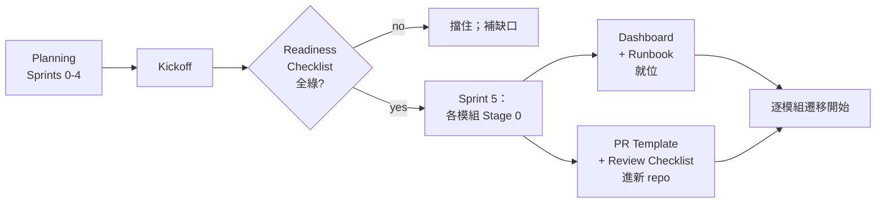

# 交接到實作（Handoff to Implementation）

規劃再好，工程團隊第一天打開 repo 看不出從哪開始就白費。kit 的 handoff 段是讓「我們有計畫」到「我們在執行」無縫銜接的那組文件。

## 五份產出，不可省

1. **[Readiness Checklist](../handoff/readiness-checklist)** — 組織、文件、infra、平台能力、遷移 tooling、安全的 pre-flight 清單。Architect + PM 在 Sprint 5 前雙簽
2. **[PR Template](../handoff/pr-template)** — 帶 traceability 欄位、migration stage、risk tier。直接塞 `.github/pull_request_template.md`
3. **[Code Review Checklist](../handoff/code-review-checklist)** — 10 個 review 維度、含 hard-blocker（繞過 Ontology codegen、去掉金流 HITL、降低覆蓋率）。reviewer 當尺用
4. **[Module Runbook Template](../handoff/module-runbook-template)** — on-call playbook 骨架。每個模組 Stage 0 前一份填好的
5. **[Monitoring Dashboard Spec](../handoff/monitoring-dashboard-spec)** — 6 面板標準布局。讓模組 dashboard 可比較

## 交接順序

## 誰擁有什麼

| 產物 | 交接時 owner |
|---|---|
| Readiness Checklist | Architect + PM Lead（聯合簽核） |
| PR Template | DevOps / platform lead 塞新 repo |
| Code Review Checklist | Engineering lead 分發全 reviewer |
| Module Runbook | 各模組工程 owner |
| Monitoring Dashboard | SRE / platform lead、每模組一份 |

## 常見交接失敗模式

### 「Sprint 6 再修」

Readiness 未勾**應該**擋 handoff。傾向延後的團隊會在生產事故中發現這些。別這樣。SSO 在 staging 不能用就是 Sprint 5 kickoff blocker、不是後續 sprint 項目。

### 「Runbook 是 architect 的事」

不是。將要 on-call 的工程師填 runbook。Architect 檢視。工程師不會填 → 他還不夠熟這模組、這是信號、不是文書延遲。

### 「Dashboard 上線後再建」

Dashboard 在任何模組 Stage 1 前存在。Block A（Health）+ Block C（Migration）panel 應顯示 `no data yet` 而非不存在。你不能 debug 看不到的東西。

### 「PR template 只是表單、reviewer 跳過」

至少 traceability 欄位強制填（CI 檢查）。PR body 空白就不 merge。reviewer 不用**讀** checklist，貢獻者必須**填**。

## 交接後

規劃 workspace（本 kit 或你的領域擴充）變**唯讀參考**。日常工作移到實作 repo。規劃 repo 用於：
- 查 ADR 理由
- 重讀 Strangler Fig 協議
- 季度檢視北極星
- 新成員 onboarding

若規劃文件開始脫離現實，排個 mini-sprint 對齊 — 不是放棄它們。plan rot 快（見 kit retrospective 模板的半衰曲線）。

## 相關

- [Handoff Overview](../handoff/overview)
- [概念：Strangler Fig](../concepts/strangler-fig)
- [Guide: 撰寫北極星](./authoring-north-star)
