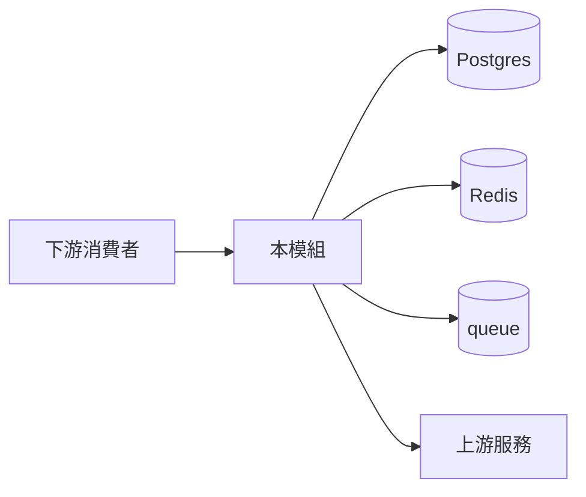

# 模組 Runbook 範本

On-call playbook 骨架。複製到 `apps/<service>/<module>/RUNBOOK.md` 並填。跟程式碼同住才能保持同步。

---

````markdown
# <模組名> — Runbook

- **Module ID:** <domain.module_id>
- **Owner:** @<team-lead>
- **On-call rotation:** <排班連結>
- **Status dashboard:** <Datadog / Grafana 連結>
- **SLO:** <p95 latency、錯誤率、對帳容忍度>

## 1. 依賴



| 依賴 | 連線 | 失效影響 |
|---|---|---|
| Postgres | pool | 寫失敗；讀退到快取 |
| Redis | cache + queue | 效能降級 |
| Queue | 事件 publish | 跨模組事件延遲 |

## 2. 常見事故 playbook

### 2.1 5xx 錯誤率飆升

**偵測**：alert `<module>.error_rate > 1% × 5min`

**排查**：
1. Sentry 最新錯誤：<URL>
2. DB pool 狀態：<URL>
3. 上游健康：<URL>
4. 近期 deploy：`gh run list --workflow=deploy`

**處置**：
- DB connection 耗盡 → scale api pod、kill long query
- 上游 timeout → 開 circuit breaker、通知上游
- Bad deploy → 5 分鐘內 rollback

### 2.2 對帳 diff 超 SLO（遷移期）

**偵測**：`<module>.reconciliation.diff_rate > SLO`

**排查**：
1. `SELECT * FROM reconciliation_diffs WHERE module='<module>' ORDER BY detected_at DESC LIMIT 50`
2. 最近有 schema 變更？`git log packages/db/schema/<module>.*.ts`
3. Bridge worker lag：<URL>

**處置**：
- 小批差異 → 手動對帳 + patch
- 大批 → 暫停階段進展、回前一 stage、查根因
- > 24h 持續 → 升級 P1、engage architect

### 2.3 HITL queue 阻塞

**偵測**：pending > 50 或最老任務 > 4h

**處置**：
1. HITL dashboard 看卡在哪
2. 審批人不在 → 升級 backup
3. Agent loop → 暫停 workflow、關 feature flag

### 2.4 Agent / LLM 成本飆升

**偵測**：`llm.cost.per_hour > baseline × 2`

**處置**：
1. Token dashboard：哪個 feature / tenant / model
2. 無限迴圈？檢查 retry pattern
3. 開 rate limit、關受影響 feature flag
4. 通知 AI team + cost owner

## 3. 常用操作

### 切遷移 feature flag
```bash
gh pr create --base main --title "flag: migration.<module>.mode = double_write"
```

### 手動對帳
```bash
pnpm --filter @<org>/worker reconcile --module <module> --window 24h
```

### Deploy rollback
```bash
gcloud run services update-traffic api --to-revisions=<prev>=100
vercel rollback <deployment-url>
```

## 4. 升級路徑

| 等級 | 觸發 | 聯絡 |
|---|---|---|
| P3 | 單用戶影響 | 模組 owner |
| P2 | 多用戶 + workaround | owner + on-call manager |
| P1 | 模組不可用 / 資料風險 | architect + owner + VP |
| P0 | 金流 / PII / 法遵 | war-room：architect, CTO, finance, legal |

## 5. 模組坑

<!-- 前一位 on-call 被什麼絆倒。例如：
- 發票號碼單調、不可 gap
- Cache TTL 30s；stale-read window
- status='locked' 的 row 不可更新
-->

## 6. Post-incident

任何 P0/P1 事故 24h 內寫 postmortem：

```
# Postmortem: <title>
Date: YYYY-MM-DD
Duration: <start–resolved>
Impact: <users/txns/$>
Root cause:
Timeline:
Action items:
  - [ ] 回歸測試
  - [ ] Runbook 條目
  - [ ] Alert
```
````
