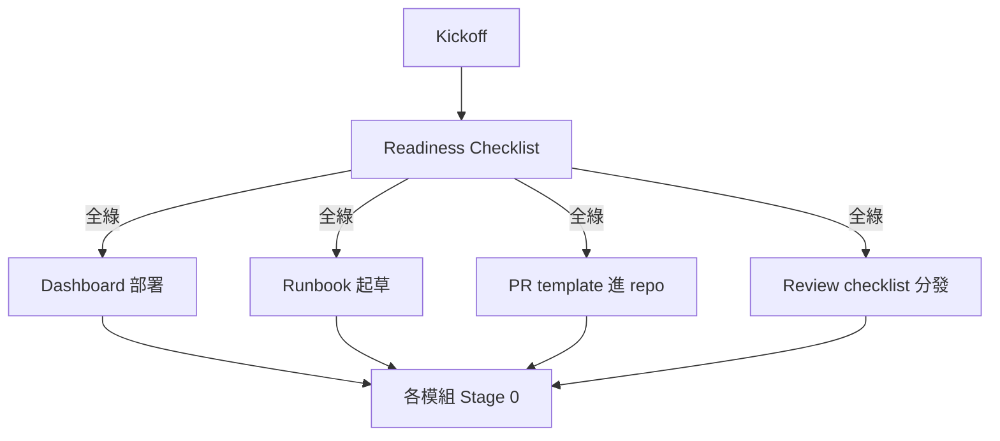

# Handoff Kit 總覽

工程團隊在規劃結束、實作開始時繼承的五份產物。複製到實作 repo 的 `.github/`、`docs/` 或 wiki。寫好就能直接塞進去、不用改。

| 檔案 | 放到 | 用途 |
|---|---|---|
| [`pr-template.md`](./pr-template) | `.github/pull_request_template.md` | 強制 traceability、migration-stage、risk tier 欄位 |
| [`code-review-checklist.md`](./code-review-checklist) | `docs/CODE_REVIEW.md` 或 wiki | 10 個 review 維度、含明確 hard-blocker |
| [`module-runbook-template.md`](./module-runbook-template) | `apps/<service>/<module>/RUNBOOK.md` | 逐模組 on-call playbook 骨架 |
| [`monitoring-dashboard-spec.md`](./monitoring-dashboard-spec) | Datadog / Grafana / Vercel Analytics | 6 面板標準布局 |
| [`readiness-checklist.md`](./readiness-checklist) | Sprint 5 kickoff gate | Architect + PM 聯合簽核 |

## 原則

### 複製、不客製

如果團隊在真的用之前開始 bikeshedding 範本，你已經輸了。先複製用、2–3 sprint 真實使用後再改。

### 追溯性不是選配

上面每個產物都接 `doc_id` 或 migration stage。拿掉這些欄位就違反 kit 存在的原因。

### HITL 不可降級

Code-review checklist 對「金流 / 不可逆寫操作去掉 HITL」是 hard-blocker。無論 deadline 怎樣都不可退讓。

## 互相關係

## 相關

- [Guide: 交接到實作](../guides/handoff-to-implementation) — 整體順序與失敗模式
