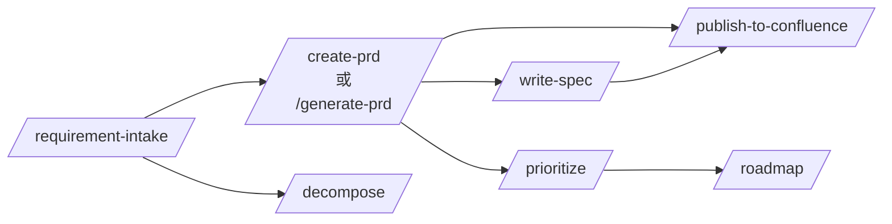

# Skills 目錄

kit 提供 14 個 Claude Code skills 對應 PM workflow。每個 skill 是自成一體的 prompt + 指令檔，塞入專案的 `.claude/skills/`。Claude Code 在 skill description 對應使用者意圖時自動呼叫，或用 `/<skill-name>` 明確呼叫。

## Pipeline 視圖



## 14 個 skills

### 核心 pipeline（5）

| Skill | 用途 | 何時 |
|---|---|---|
| [requirement-intake](./requirement-intake.md) | AI 引導需求蒐集 | Stakeholder 帶來模糊想法 |
| [generate-prd](./generate-prd.md) | 由需求卡自動產 PRD | 需求清楚、規模小中 |
| [create-prd](./create-prd.md) | 互動式 PRD 撰寫 | 大規模或綠地功能 |
| [write-spec](./write-spec.md) | PRD → 技術 spec | PRD 核准後工程需細節 |
| [publish-to-confluence](./publish-to-confluence.md) | 推文件到 Confluence + 回寫 | PRD / spec 已 Approved |

### 探索與規劃（4）

| Skill | 用途 | 何時 |
|---|---|---|
| [brainstorm-new](./brainstorm-new.md) | 新產品多角度發想 | 0-to-1 產品探索 |
| [brainstorm-existing](./brainstorm-existing.md) | 現有產品擴展想法 | 季度規劃 |
| [research](./research.md) | 結構化競品 / 市場研究 | PRD 需市場 context |
| [gather-requirements](./gather-requirements.md) | 結構化 stakeholder 訪談 | 需求寫不出來 |

### 拆解與優先（3）

| Skill | 用途 | 何時 |
|---|---|---|
| [decompose](./decompose.md) | 需求拆為可執行任務 | 從需求到執行 |
| [prioritize](./prioritize.md) | 套 MoSCoW / RICE | 功能清單 > 容量 |
| [roadmap](./roadmap.md) | 功能排序到時間計畫 | 季度 / 年度規劃 |

### 運營（2）

| Skill | 用途 | 何時 |
|---|---|---|
| [bug-report](./bug-report.md) | 引導 bug 記錄含分診 | 使用者非正式報 bug |
| [create-pptx](./create-pptx.md) | 從 markdown 產 PowerPoint | Stakeholder 要投影片 |

## 如何安裝 skill

每個 skill 頁內有 code block 含本體。複製內容到你專案的 `.claude/skills/<skill-name>.md`：

```bash
mkdir -p .claude/skills
# 從文件站複製 skill 內容到 .claude/skills/<skill-name>.md
```

Claude Code 自動撿到。`/help` 確認 skill 出現在清單。

## 客製化

kit skills 寫給通用 B2B SaaS workflow。你可能要改：
- 公司特定術語（把通用「customer」換成你的領域詞）
- 輸出檔路徑（kit 用 `docs/prds/` 等）
- 發佈目標（kit 用 Confluence；你可能用 Notion）
- 語言（kit skills 英文；可翻譯）

## 需要工具的 skills

有些 skill 呼外部 API、需工具配置：

- **publish-to-confluence** — 需有 Confluence 存取的 browser / HTTP tool
- **create-pptx** — 需 [Anthropic Agent Skills API](https://docs.anthropic.com/) 或相當 PPTX 產生器
- **research** — 有 web-fetch 能力時最好

工具不存在時 skill 會 graceful 降級（要你手動提供資訊）。

## 相關

- [概念：DoR / DoD](../concepts/definitions-of-ready-done.md)
- [Guide: 交接到實作](../guides/handoff-to-implementation.md)
