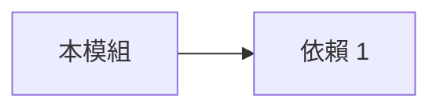
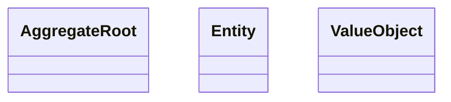
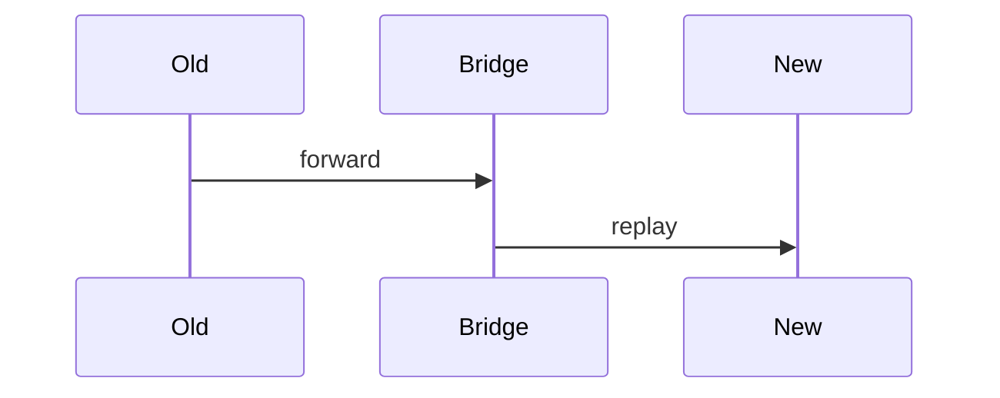

# 模組遷移 Playbook 範本

每個走 Strangler Fig 的模組一份 playbook。複製到 `docs/architecture/modules/<module-id>-migration.md` 並填充。

12 節。Section 1–3 在 Stage 0 prep 前必要。4–8 於 Stage 0–1 填。9–12 隨遷移成熟。

---

````markdown
# <模組名> — Migration Playbook

- **Module ID:** <domain.module_id>
- **Status:** Draft <!-- Draft | In Migration | Retired -->
- **Date:** YYYY-MM-DD
- **Owner:** @<engineering-lead>
- **Migration Priority:** Group <1|2|3|4>
- **Source Ontology:** <ontology 路徑或 N/A>

## 1. 模組概述
<業務角色、Entity、規模（日寫入、活躍 row）、為何在此遷移組。>

## 2. As-Is 結構

### Models / Controllers / Services
- <列現有 model>
- <列現有 controller>
- <列現有 service — 標 fat 需拆的>

### 依賴圖


## 3. 目標 schema / Ontology 映射

### Coverage
| Entity | 新系統已覆蓋 | 缺口 |
|---|---|---|
| A | ✅ | — |
| B | ⚠️ 部分 | 缺 `foo` 欄 |

### Stage 0 需補的缺口
<新增欄位、state machine、business rule>

## 4. 目標領域模型
### Bounded context
<模組擁有什麼？明確不擁有什麼？>

### Aggregate / Entity / Value Object


### 模組結構
```
apps/<app>/src/<module>/
  <module>.module.ts
  services/
  domain/
```

## 5. 目標資料模型
### Schema（生成 / 手寫）
<schema 片段>

### 索引策略
| 欄位 | 索引類型 | 理由 |
|---|---|---|

### 雙寫設計
<Stage 2–3 期間新舊 schema 共存方式>

## 6. API 契約
### 新 endpoint / RPC
<tRPC / OpenAPI / RPC 契約>

### legacy 相容
| Legacy | 新 | 策略 | 下線日期 |
|---|---|---|---|

## 7. Agent Tools（若暴露給 AI）
| Tool | 用途 | 授權 | HITL |
|---|---|---|---|
| `<module>.list` | | role ≥ viewer | no |
| `<module>.create` | | role ≥ operator | yes if amount > X |

## 8. LLM 使用案例
每個 AI 階段（Copilot / Embedded / Agentic / AI-Native）各舉一例。

## 9. 遷移步驟（Strangler Fig）


### 各階段 checklist
**Stage 0（Prep）**
- [ ] Ontology / schema 就緒
- [ ] 對帳 tooling 可跑
- [ ] Feature flag 建立

**Stage 1（Shadow Read）**
- [ ] diff < SLO × 7 天

**Stage 2（Double Write）**
- [ ] diff < SLO × 14 天

**Stage 3（Cutover）**
- [ ] KPI 持平 × 14 天

**Stage 4（Retire）**
- [ ] 觀察期完成
- [ ] 舊路徑凍結

## 10. 風險與 rollback
| 風險 | Likelihood | Impact | 緩解 | Rollback |
|---|---|---|---|---|

## 11. 成功指標
| KPI | Baseline | Target |
|---|---|---|
| 對帳差異率 | — | < X% |
| p95 latency | — | ≤ baseline |
| 錯誤率 | — | ≤ baseline |
| 遷移總週期 | — | ≤ N 週 |

## 12. 相關 ADR
- ADR-NNNN: <此設計理由>
- 跨模組：<相關模組、契約>
````
