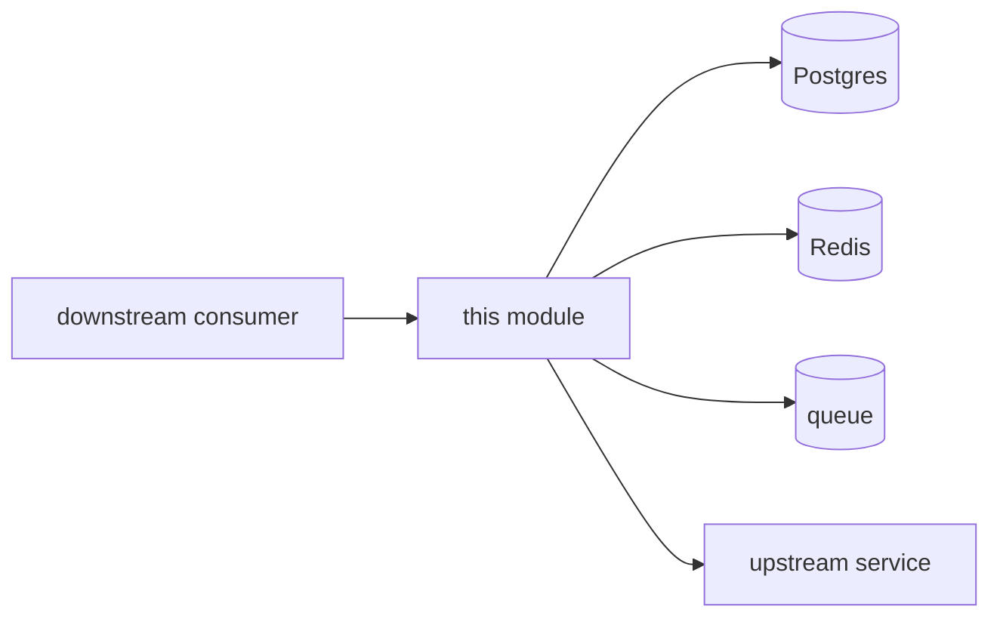

# Module Runbook Template

On-call playbook skeleton. Copy to `apps/<service>/<module>/RUNBOOK.md` and fill in. Lives next to the code so it stays current.

---

```markdown
# <Module Name> — Runbook

- **Module ID:** <domain.module_id>
- **Owner:** @<team-lead>
- **On-call rotation:** <link to rotation table>
- **Status dashboard:** <link to Datadog / Grafana>
- **SLO:** <p95 latency, error rate, reconciliation tolerance>

## 1. Dependencies



| Dependency | Connection | Failure mode |
|---|---|---|
| Postgres | pool | writes fail; reads degrade to cache |
| Redis | cache + queue | performance drop; still runnable |
| Queue | event publish | cross-module events delayed |
| External API | HTTP | circuit breaker; fallback TBD |

## 2. Common incident playbooks

### 2.1 5xx error rate spike

**Detect:** alert `<module>.error_rate > 1% for 5min`

**Triage:**
1. Sentry latest errors: <URL>
2. DB pool status: <URL>
3. Upstream health: <URL>
4. Recent deploys: `gh run list --workflow=deploy`

**Common causes & action:**
- DB connection exhaustion → scale api pods, kill long-running queries
- Upstream timeout → open circuit breaker, page upstream team
- Bad deploy → roll back within 5 min

### 2.2 Reconciliation diff over SLO (migration only)

**Detect:** `<module>.reconciliation.diff_rate > SLO`

**Triage:**
1. `SELECT * FROM reconciliation_diffs WHERE module = '<module>' ORDER BY detected_at DESC LIMIT 50`
2. Recent schema changes? Check `git log packages/db/schema/<module>.*.ts`
3. Bridge worker lag: <URL>

**Action:**
- Small batch → manual reconcile + patch
- Large batch → halt stage progression, roll back to previous stage, investigate root cause
- Persistent > 24h → escalate to P1, engage architect

### 2.3 HITL queue stuck

**Detect:** pending HITL tasks > 50, or oldest > 4h

**Action:**
1. Identify stuck workflows in HITL dashboard
2. Approver absent? escalate to backup
3. Agent loop? pause workflow, disable feature flag
4. Pending tasks > 200 → P2 incident

### 2.4 Agent / LLM cost spike

**Detect:** `llm.cost.per_hour > baseline × 2`

**Action:**
1. Token dashboard: which feature / tenant / model?
2. Infinite loop suspicion? check retry pattern
3. Enable rate limit, disable affected feature flag
4. Notify AI team + cost owner

## 3. Common operations

### Toggle migration feature flag
```bash
# Stage transitions require 2-person sign-off
gh pr create --base main --title "flag: migration.<module>.mode = double_write"
```

### Manual reconciliation
```bash
pnpm --filter @<org>/worker reconcile --module <module> --window 24h
```

### Deploy rollback
```bash
# Cloud Run
gcloud run services update-traffic api --to-revisions=<prev>=100
# Vercel
vercel rollback <deployment-url>
```

### Trace lookup
```
https://<otel-backend>/traces?service=<module>&trace_id=<id>
```

## 4. Escalation

| Level | Trigger | Contacts |
|---|---|---|
| P3 | single user; can wait | module owner |
| P2 | multi-user; workaround exists | owner + on-call manager |
| P1 | module unavailable / data at risk | architect + owner + VP |
| P0 | money / PII / regulatory | war-room: architect, CTO, finance, legal |

## 5. Module-specific gotchas

<!-- What surprised the last person on-call. Examples:
- Invoice numbers are monotonic and must not gap/duplicate
- Cache TTL is 30s; stale-read window if upstream writes
- This module's rows are immutable after status='locked' — don't try to update
-->

## 6. Post-incident

Any P0/P1 triggers a postmortem within 24h:

```
# Postmortem: <title>
Date: YYYY-MM-DD
Duration: <start–resolved>
Impact: <users/txns/$>
Root cause:
Timeline:
Action items:
  - [ ] add regression test
  - [ ] add runbook entry
  - [ ] add alert
```
```
