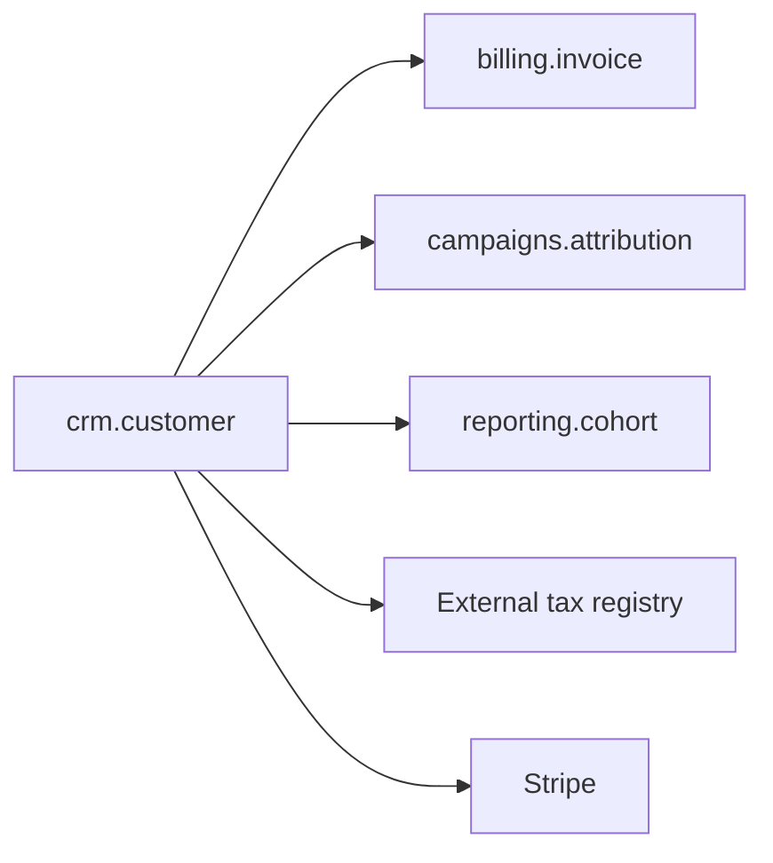

# crm.customer — Migration Playbook

- **Module ID:** crm.customer
- **Status:** In Migration (Stage 1)
- **Date:** 2026-04-20
- **Owner:** @alex-eng
- **Migration Priority:** Group 1 (foundational)
- **Source Ontology:** `ontology/systems/crm.yaml` → `modules[0]`

## 1. Module overview

Customer master records — one per advertiser billing account. ~120k rows, ~400 new per day. Referenced by `billing`, `campaigns`, and `reporting`. Any migration here blocks downstream modules, so this goes first.

## 2. As-Is structure

### Models / controllers / services (Python / Flask)

- `app/models/customer.py` — 340 LOC, includes email normalization + tax validation
- `app/models/contract.py` — 180 LOC
- `app/models/contact.py` — 90 LOC
- `app/blueprints/customer_api.py` — REST endpoints, ~450 LOC
- `app/services/customer_onboarding.py` — orchestrator; ~250 LOC with 6 external calls

### Dependency diagram



## 3. Ontology mapping

### Coverage

| Entity | Covered | Gap |
|---|---|---|
| Customer | ✅ full | — |
| Contact | ✅ full | `last_contacted_at` not modeled yet |
| Contract | ✅ full | PDF versioning not in ontology |

### Gaps to backfill in Stage 0

- Add `Contact.last_contacted_at` (timestamp nullable)
- Add `Contract.version_history` (JSONB of prior signed PDFs with timestamps)

## 4. To-Be domain model

### Bounded context

Owns: customer master, contract lifecycle, contact book. Publishes `customer.{created|suspended|churned|onboarded}` events. Does NOT own: invoicing (billing), attribution (campaigns).

### Module structure (Go monolith per ADR-0004)

```
internal/crm/
  customer/
    service.go        # onboarding, state transitions
    repository.go
    events.go
  contract/
    service.go
    repository.go
  contact/
    service.go
    repository.go
  external/
    tax_registry.go   # adapter
    stripe.go
  apierror/
```

## 5. To-Be data model

### Schema (Postgres, generated from ontology YAML)

```sql
CREATE TABLE customers (
  id UUID PRIMARY KEY,
  company_name TEXT NOT NULL,
  tax_id TEXT NOT NULL,
  tier TEXT NOT NULL CHECK (tier IN ('self_serve','standard','enterprise')),
  status TEXT NOT NULL CHECK (status IN ('active','suspended','churned')),
  created_at TIMESTAMPTZ NOT NULL DEFAULT NOW(),
  onboarded_at TIMESTAMPTZ,
  legacy_python_id INTEGER UNIQUE -- dual-write join key
);
CREATE UNIQUE INDEX customers_tax_id_country ON customers (tax_id, country);
CREATE INDEX customers_status ON customers (status);
```

### Dual-write strategy (Stage 2)

Both old (Python/MySQL) and new (Go/Postgres) receive writes. Reconciliation job joins on `legacy_python_id`. Differences > 0.001% (per PII override below) halt stage progression.

## 6. API contract

Stage 3 cutover preserves Python REST shape for 60 days:

```
GET /api/v1/customers         → new Go service, same JSON
POST /api/v1/customers        → dual-write (Stage 2) / new-only (Stage 3+)
PATCH /api/v1/customers/:id   → dual-write / new-only
```

## 7. Agent tools (kit workflow)

| Tool | Purpose | Auth | HITL |
|---|---|---|---|
| `crm.customer.list` | Search customers | role ≥ support | — |
| `crm.customer.get` | Read one customer | role ≥ support | — |
| `crm.customer.create` | New customer | role ≥ ops | yes if tier=enterprise |
| `crm.customer.suspend` | Suspend account | role ≥ ops | **always** |
| `crm.customer.churn` | Mark churned | role ≥ ops_lead | **always** |

## 8. LLM use cases

- **Copilot**: customer support agent asks "when did this customer onboard + what's their current tier?" — LLM calls `crm.customer.get`, answers in-channel.
- **Embedded**: onboarding Q&A bot uses `crm.customer.get` to personalize messaging.
- **Agentic**: fraud review workflow — LLM reads signup signals, suggests suspend, **HITL approval** before `crm.customer.suspend`.
- **AI-native**: not applicable for this module.

## 9. Migration steps

### Stage 0 — Prep (✅ done 2026-03-30)

- [x] Ontology gap backfilled (Contact.last_contacted_at, Contract.version_history)
- [x] Go service + Postgres schema deployed to staging
- [x] `scripts/reconcile-crm-customer.go` runnable
- [x] Feature flag `migration.crm.customer.mode` created, default `shadow_off`

### Stage 1 — Shadow Read (**in progress** since 2026-04-15)

- [x] Bridge deployed; read traffic forwarded
- [x] Diff log populated to `reconciliation_diffs` table
- [ ] < 0.1% diff rate × 7 days **(currently at day 9, 0.03% — on track)**

### Stage 2 — Double Write

Planned start: 2026-04-27.

- [ ] Dual-write wired; bridge queues new-side failures to DLQ
- [ ] Hourly reconciliation; all aggregates match
- [ ] **Module-specific override**: PII = `confidential` on many fields → reconciliation tolerance **< 0.001%** (5× tighter than kit default)
- [ ] 14 consecutive days below threshold

### Stage 3 — Cutover

- [ ] Feature flag flipped to `new_primary`
- [ ] Reverse-sync to old Python service active for 60 days
- [ ] KPIs steady × 14 days

### Stage 4 — Retire

- [ ] Python models frozen (PRs refused via code-owner rule)
- [ ] MySQL tables read-only; full snapshot archived to S3
- [ ] 30-day observation through one monthly billing close

## 10. Risks & rollback

| Risk | Likelihood | Impact | Mitigation | Rollback |
|---|---|---|---|---|
| Tax registry call latency degradation | M | P2 | Timeout + queue retry | Flag flip to old path (< 5min) |
| Dual-write divergence on tax_id dedup | L | P1 | Stage 0 replay of 90 days of signups | Pause stage progression; reconcile |
| PII exposure in log during migration | L | P0 | Log redaction at bridge layer, reviewed in security review | Incident playbook; rotate if needed |
| Stripe webhook replay during cutover | M | P2 | Idempotency keys on receiver; replay window 24h | No rollback needed; replay reconciles |

## 11. Success metrics

| KPI | Baseline | Target |
|---|---|---|
| Reconciliation diff rate | — | < 0.001% over 14d |
| Customer create p95 | 620ms | ≤ 400ms |
| Suspend action p95 | 1.2s | ≤ 500ms |
| Error rate | 0.3% | ≤ 0.3% |
| Migration duration (Stage 0–4) | — | ≤ 12 weeks (Stage 4 observation is long) |

## 12. Related

- ADR-0004 — chose Go monolith (this module implements against that ADR)
- ADR-0001 — Strangler Fig protocol adopted
- `billing.invoice` playbook — receives `customer.created` events; coordinates on cutover day
